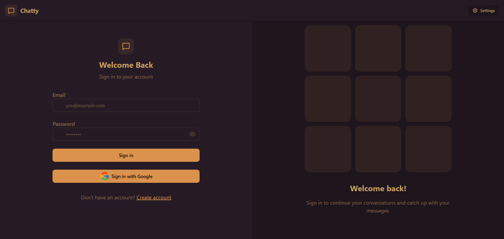
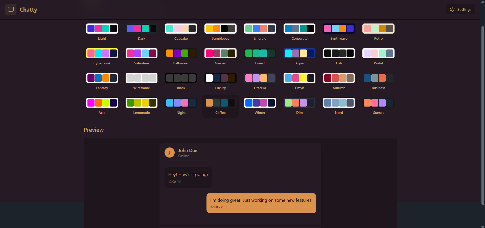

# 💬 MERN Chat App

A real-time chat application built with the **MERN stack (MongoDB, Express.js, React.js, Node.js)**, **Socket.IO**, and **Firebase Google Authentication**. It supports **user authentication, real-time messaging, online user status, and image sharing** via Cloudinary.

---

## 🚀 Features

* 🔐 **Authentication**

  * Email/Password login & signup (JWT)
  * Google Authentication via Firebase
* 💬 Real-time messaging with **Socket.IO**
* 🟢 Online/Offline user status tracking
* 🛡️ **JWT Middleware** for route protection
* 📷 Image upload & sharing (Cloudinary integration)
* 📱 Responsive design with modern UI (React + TailwindCSS)
* 🎨user can change themes from the setting
* 📂 MongoDB for storing user & chat data

---

## 🛠️ Tech Stack

**Frontend:** React, Vite, TailwindCSS, DaisyUI, Zustand(state management), Firebase (Google Auth)
**Backend:** Node.js, Express.js, Socket.IO, Firebase Admin SDK
**Database:** MongoDB with Mongoose
**Cloud Storage:** Cloudinary (for image uploads)
**Authentication:** JWT + Firebase Google Auth

---

## 📦 Installation

### 1️⃣ Clone the repository

```bash
git clone https://github.com/yourusername/chat-app.git
cd chat-app
```

### 2️⃣ Install dependencies

For backend:

```bash
cd backend
npm install
```

For frontend:

```bash
cd frontend
npm install
```

### 3️⃣ Setup environment variables

**Backend `.env`**

```env
PORT=5000
MONGO_URI=your_mongodb_url
JWT_SECRET=your_jwt_secret
CLOUDINARY_CLOUD_NAME=your_cloud_name
CLOUDINARY_API_KEY=your_api_key
CLOUDINARY_API_SECRET=your_api_secret

It also has firebase admin SDK config!
```

**Frontend `.env`**

```env
VITE_API_URL=http://localhost:5000

# Firebase config
VITE_FIREBASE_API_KEY=your_firebase_api_key
VITE_FIREBASE_AUTH_DOMAIN=your_firebase_auth_domain
VITE_FIREBASE_PROJECT_ID=your_firebase_project_id
VITE_FIREBASE_STORAGE_BUCKET=your_firebase_storage_bucket
VITE_FIREBASE_MESSAGING_SENDER_ID=your_firebase_sender_id
VITE_FIREBASE_APP_ID=your_firebase_app_id
```

---

## ▶️ Running the App

Start backend:

```bash
cd backend
npm run dev
```

Start frontend:

```bash
cd frontend
npm run dev
```

## 📸 Screenshots

### 🔐 Login Page


### 💬 Chat Window


### 🟢 Setting Page or Themes



---
